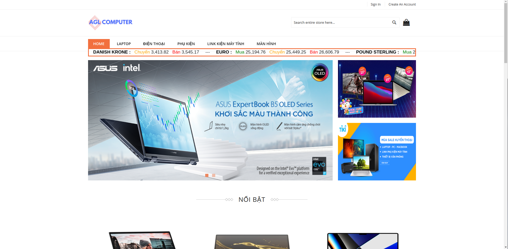
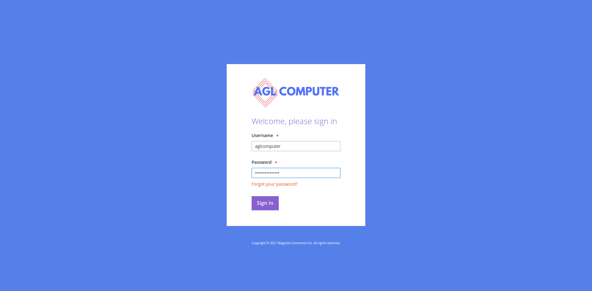
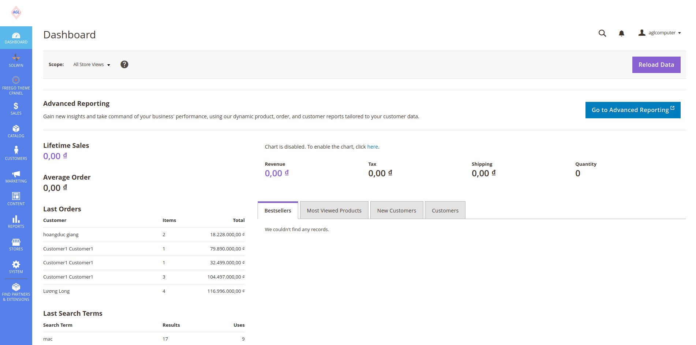

## Tổng quan
AGLcomputer là hệ thống thương mại điện tử  chuyên dụng cho cửa hàng bán máy tính và thiết bị điện tử. Được phát triển từ mã nguồn mở Magento 2 (phiên bản 2.4) và tích hợp với các phương thức thanh toán online phổ biến hiện nay: momo, vnpay, zalopay. Ngoài ra AGLcomputer còn có module tỉ giá tiền tệ, tra cứu thời tiết, xem các bản tin kinh doanh trên trang VNexpress nhằm phục vụ những nhu cầu khác của người sử dụng.

## Môi trường phát triển của hệ thống
- Ubuntu 20.04.1
- Magento 2.4.0
- PHP 7.3.33
- Composer 1.10.24
- Nginx 1.18.0
- Mysql 8.0.27
- Elasticsearch 7.16.2

## Hướng dẫn cài đặt
Ở thư mục aglcomputer được code về
### Tải mã nguồn bằng lệnh
``` sh
    git clone https://github.com/hca610/aglcomputer.git
```

### Cài đặt môi trường phát triển bằng docker:
``` sh
    cd docker_deploy
    docker-compose up --build
    cd ..
```

### Cài đặt cơ sở dữ liệu
``` sh
    sudo mysql -u aglcomputer -pPass@magento123 aglcomputer < ./database.sql
```

Sau khi cài đặt xong, ta có thể truy cập vào tên miền [aglcomputer.store](http://aglcomputer.store/) trên browser để sử dụng giao diện người dùng và [aglcomputer.store/admin](http://aglcomputer.store/admin/) để sử dụng giao diện quản trị hệ thông.

## Ảnh chụp màn hình
### Giao diện khách hàng


### Trang đăng nhập quản trị hệ thống


### Giao diện quản trị viên


## Các thông số mặc định
### Tài khoản quản trị (admin)
```
    Username: aglcomputer
    Password: Pass@magento123
```
### Cơ sở dữ liệu
```
    Tên tài khoản mysql: aglcomputer
    Mật khẩu đăng nhập mysql: Pass@magento123

    Tên database: aglcomputer
    
    Tên tài khoản được cấp quyền sử dụng database: aglcomputer
    Mật khẩu tài khoản được cấp quyền sử dụng database: Pass@magento123
```
